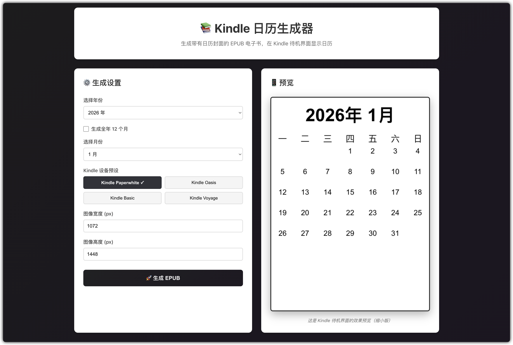

# Kindle Calendar Generator

生成 Kindle 日历电子书的 Node.js + React 应用。



## 项目简介

生成一本 EPUB 电子书，封面是每个月的日历，内容为空。Kindle 在待机时会显示封面，因此可以将日历显示在 Kindle 主屏幕上。

## 功能特点

- 📱 **Web 界面**：可视化配置和实时预览，生成 SVG 格式日历
- 💻 **命令行工具**：批量生成 EPUB 格式电子书
- 🎨 中文星期显示（一到日）
- 📚 支持生成单月或全年 12 个月
- 🖥️ 预设多种 Kindle 设备分辨率

## 技术栈

- Frontend: React + Vite
- Backend/CLI: Node.js (ES Modules)
- 图像生成: 纯 JavaScript SVG（无需编译原生模块）
- EPUB 生成: archiver（手动构建标准 EPUB 结构）

## 安装

```bash
npm install
```

## 使用方法

### Web 界面

```bash
# 启动开发服务器
npm run dev

# 访问浏览器打开的地址（通常是 http://localhost:3001）
# 在界面中选择年份、月份、设备预设，点击生成按钮下载 SVG 文件
```

**注意**：Web 界面生成 SVG 格式图片，可用作电子书封面或独立使用。如需生成 EPUB 电子书，请使用命令行工具。

### 命令行工具（推荐用于生成 EPUB）

```bash
# 生成当前月份的 EPUB
npm run generate

# 生成指定月份的 EPUB
npm run generate -- --month 3 --year 2026

# 生成全年 12 个月的 EPUB
npm run generate -- --all --year 2027

# 自定义输出目录
npm run generate -- --output my_calendars/

# 自定义图像尺寸（例如：Kindle Oasis）
npm run generate -- --width 1264 --height 1680
```

## Kindle 设备分辨率

- Kindle Paperwhite: 1072×1448 (默认)
- Kindle Oasis: 1264×1680
- Kindle Basic: 800×1280
- Kindle Voyage: 1072×1448

## 文件传输

生成的 EPUB 文件位于 `output/` 目录，文件名格式为 `calendar_YYYY_MM.epub`。

将文件传输到 Kindle：
1. 通过 USB 连接 Kindle 并复制文件到 `documents` 文件夹
2. 或通过邮件发送到 Kindle 邮箱

## 项目结构

```
kindle-calendar/
├── src/
│   ├── main.jsx              # React 入口
│   ├── App.jsx               # 主应用组件
│   ├── components/           # React 组件
│   │   ├── CalendarForm.jsx  # 配置表单
│   │   └── CalendarPreview.jsx  # 日历预览
│   ├── lib/                  # 核心逻辑
│   │   ├── calendarGenerator.js  # 日历图像生成
│   │   └── epubGenerator.js      # EPUB 生成
│   └── cli.js                # 命令行工具
├── index.html                # HTML 入口
├── vite.config.js            # Vite 配置
└── package.json              # 依赖配置
```

## 构建生产版本

```bash
npm run build
npm run preview
```

## 依赖

- react: Web 界面
- vite: 开发服务器和构建工具
- archiver: EPUB 文件打包（ZIP 格式）
- commander: CLI 参数解析

## 技术说明

本项目使用纯 JavaScript SVG 生成日历图像，避免了 node-canvas 等需要编译的原生模块依赖，确保在不同 Node.js 版本和操作系统上都能顺利安装运行。
